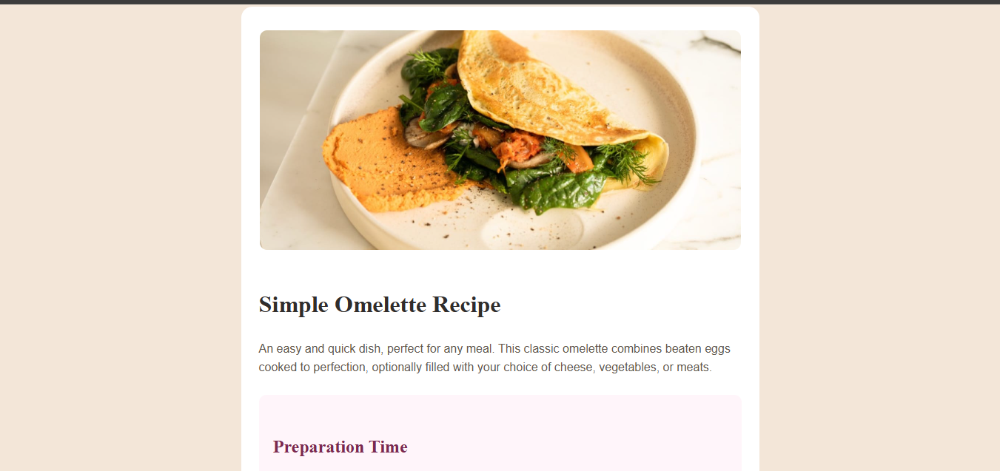

# Frontend Mentor - Recipe Page Solution

This is my solution to the Recipe Page Challenge on Frontend Mentor.  
The goal of this project was to build a fully responsive recipe layout that matches the provided design as closely as possible.

This challenge helped me improve my responsive design skills using a mobile-first workflow and deepen my understanding of CSS styling techniques.

---
## 📸 Screenshot


---

## 🔗 Links

- Solution URL: Add your Frontend Mentor solution link here  
- Live Site URL: Add your live site link here  

---

## 🚀 My Process

### 🛠 Built With

- Semantic HTML5 markup  
- CSS custom properties (variables)  
- Flexbox  
- CSS Grid  
- Mobile-first workflow  
- Custom fonts using `@font-face`  
- `::marker` pseudo-element  

---

## 🧠 What I Learned

### 1️⃣ Mobile-First Workflow

I started designing for mobile screens first, then used media queries for larger screens.

```css
body {
  margin: 0;
}

@media (min-width: 768px) {
@media (min-width: 768px) {
body {
  background-color: hsl(31, 53%, 90%);
}
main {
   max-width: 700px;
    margin: 4rem auto;
    background: white;
    border-radius: 15px;
    overflow: hidden;

}
img {
  max-width: 650px;
  margin: 2rem auto 0 auto;
  border-radius: 10px;

}
}
```
### 2️⃣ Adding Custom Fonts with @font-face

I learned how to import and use local font files instead of relying only on online font services.

```css
@font-face {
  font-family: 'YoungSerif';
  src: url('./assets/fonts/young-serif/YoungSerif-Regular.ttf') format('truetype');
  font-weight: normal;
  font-style: normal;
}

@font-face {
  font-family: 'Outfit';
  src: url('./assets/fonts/outfit/Outfit-Regular.ttf') format('truetype');
  font-weight: 400;
  font-style: normal;
}
```
This helped me understand how custom typography works in real-world projects.

### 3️⃣ Styling List Markers with ::marker
I learned how to style bullet points and numbered lists using the ::marker pseudo-element.
```css
ul li::marker,
ol li::marker {
  color: hsl(14, 45%, 36%);
  font-weight: bold;
}
```

### 📈 Continued Development
- Improve my responsive layout techniques

- Write cleaner and more maintainable CSS

- Practice CSS Grid in more complex layouts

- Focus more on accessibility best practices

### 🤖 AI Collaboration
During this project, I used ChatGPT to:

- Better understand the mobile-first workflow

- Fix layout spacing issues between mobile and desktop

- Learn how the ::marker pseudo-element works

- Debug font integration using @font-face

Using AI helped me debug faster and understand concepts clearly instead of memorizing code.

### 👤 Author

Sanseviero Owusu

- Frontend Mentor: Add your profile link here

- GitHub: Add your GitHub profile link here